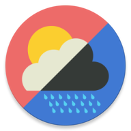
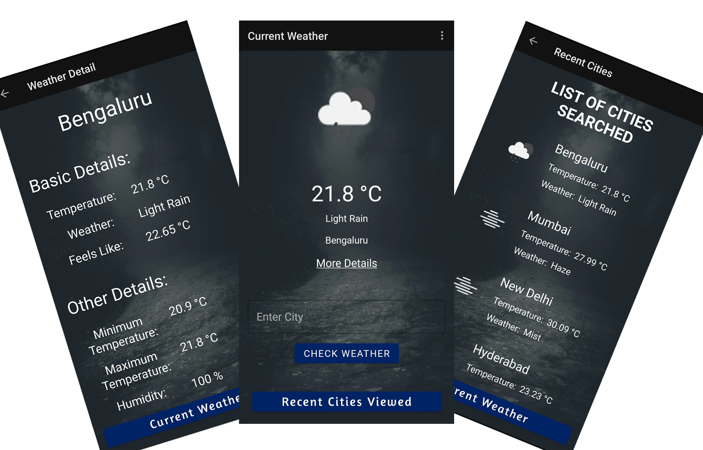
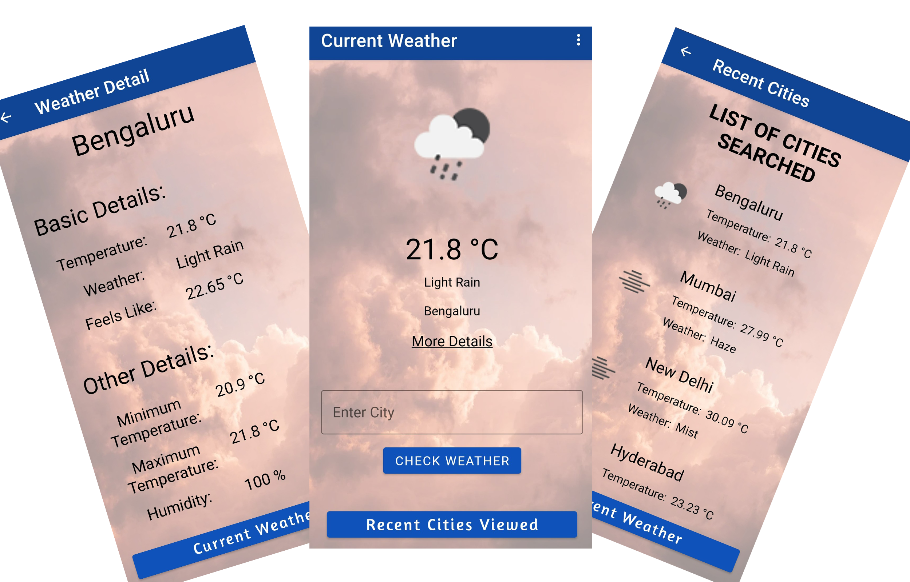

<h1 align='center'>  How's The Sky</h1>

**How's The Sky** is a Weather App made for Android devices. The app was initially developed as part of the assignment submitted for the Android Development Track of the Summer Group held by **[cruX](https://github.com/crux-bphc)**, The Programming & Computing Club of **[BITS Pilani, Hyderabad Campus](https://www.bits-pilani.ac.in/hyderabad/)**.

## Features
- Search for a City's Weather
- Stores Recently Searched Cities
- Tap on one of the Recently Searched City to get Current Weather of that City
- Get More Details (Humidity, Visibility, Wind Speed, etc.) of the City's Weather
- Has both Dark and Light Mode Support

## Dark Mode UI

## Light Mode UI

## Installation

1. **Clone the Project:**
    1. Run ` git clone https://github.com/Code-R57/HowsTheSky.git ` in terminal
    1. Android Studio -> File -> Open
    
1. **Getting API Key:**
    1. Open [OpenWeather Sign In/Sign Up](https://home.openweathermap.org/users/sign_in)
    1. Go to [OpenWeather API Keys](https://home.openweathermap.org/api_keys) and copy the API Key Generated
    
1. **Adding the API Key in the Project:**
    1. In the project folder, go to ` local.properties ` file
    1. Add the line ` OW_KEY={Your API Key} ` ( do not add the { } )

## OpenWeather API

How's The Sky uses [OpenWeather API](https://openweathermap.org/current) to get the current weather of the city searched. [OpenWeather Weather Conditions](https://openweathermap.org/weather-conditions) is used to get the image from the image id.

## Libraries

- [Coroutines](https://kotlinlang.org/docs/coroutines-overview.html) - For managing background threads
- [Retrofit](https://square.github.io/retrofit) - A type-safe HTTP client for Android
- [Glide](https://bumptech.github.io/glide) - Image loading library for Android</li>
- [SafeArgs](https://developer.android.com/guide/navigation/navigation-pass-data#Safe-args) - Pass data with type safety
- Jetpack
    - [ViewModel](https://developer.android.com/topic/libraries/architecture/viewmodel) - Store and manage UI-related data in a lifecycle conscious way
    - [LiveData](https://developer.android.com/topic/libraries/architecture/livedata) - Observable data holder class
    - [Navigation](https://developer.android.com/guide/navigation) - Implements in-app navigation
    - [Room](https://developer.android.com/training/data-storage/room) - Provides an abstraction layer over SQLite to allow fluent database access while harnessing the full power of SQLite
